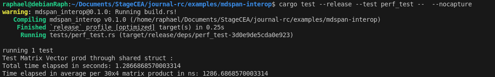
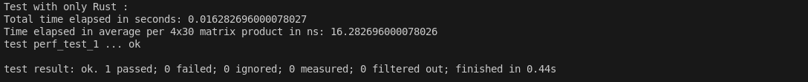

The following images show the total elapsed time and the average time per product for 2x2 matrices products, iterated 1_000_000 times.

The goal here is to see and compare the time performances of doing a matrix product using std::mdspan in C++ versus when initializing, converting and calling C++ side all from the Rust side.

### C++ : 

  
*C++ performance with O3 optimisations*
Average time per product : 30**ns**

  
*C++ performance with O0 optimisations*
Average time per product : 582**ns**

### Rust-C++ : 

*Rust-C++ performance with O3 optimisations for C++ side compilation*
Average time per product : 585**ns**

*Rust-C++ performance with O0 optimisations for C++ side compilation*
Average time per product : 1720**ns**

### Observations

The point is pretty straight forward : **the rust bridge adds a lot of overhead** (x20 in O3 and ~x3 in O0).

We here can see two important things :
- The difference between the two average times of the Rust code indicates that **a significant part of the code on the C++ side of the bridge can be optimized** by the compiler.
- The difference between the two ratios of performance gain with '-O3' and '-O0' reveals that most of the **operations done with the Rust/C++ bridge are not optimizable by clang**, which explains the significant difference between the x3 and x20.

### Things to try

To tackle these performance losses, the next steps could be to : 

- **Move all casting operations to C++ side** to benefit from eventual optimization when setting O3 (however we already have the Rust -> C++ way conversions on the C++ side, so we can only put the C++ -> Rust way conversions on the C++ to make a difference now)
- **Multiply bigger matrices**,  see the impact on memory and time performance.
- Most importantly : **pass only reference or pointers**, to avoid copies. (However this has the downside of not respecting know implementations of Blas' matrix_product, who is supposed to take objects as parameters, not refs).

### Optimization experiments

- Passing **only references** ==> times /2.
- Casting inside matrix_product instead of calling **from_shared** ==> saves a few nanoseconds, **negligible**.
- Casting inside matrix_product instead of calling **to_shared** ==> **reduces by a third** the time (280ns -> 190ns). (but this is very not practical)
- Not counting the cast from_shared at the end of operations => 190ns -> 120ns (we can see that most of the time consumed comes from the calls to the casting functions).

*Rust-C++ performance with O0 optimisations for C++ side compilation, passing references to the functions*
Average time per product : 965**ns**

*Rust-C++ performance with O3 optimisations for C++ side compilation, passing references to the functions*
Average time per product : 271**ns**

### Comparison with pure Rust

When doing these operations only in Rust (which means initializing the two ndarray and multiplying them straight away) the average time is be 13ns, so about a tenth of what we get in our best case scenario with the bridge.

**Real need to test on bigger operations with bigger matrices, to see the impact of casting and FFI calls then.**

### Larger Matrices and Layout effects

When testing with bigger matrices (120 elements, organized in 30x4 and 4x30 matrices), we mainly observe 3 things : 
- The fastest way to compute these products is with plain rust and ndarray.
- The interop way with the shared struct is almost as fast as plain C++  (1290ns vs 1145ns).
- The importance of layout comes up, as we are doing all this on CPU with default mdspan set on layout_right, the products are much more efficient with the first matrix having a shape of 4x30 instead of 30x4. (the shape of the second matrix doesn't matter as it is set to layout_right and it should be layout_left, as we are going through its columns during the product).

**With unoptimized shapes (first matrix set to be 30x4), we observe the following performance :**
 

*Rust-C++ performance with O3 optimisations for C++ side compilation, passing references to the functions, with bad shapes*
Average time per product :1286**ns**
 

*Rust only performance, with bad shapes*
Average time per product :381**ns**

*C++ only performance, with bad shapes*
Average time per product : 1145**ns**

 **When optimizing the shapes (first matrix set to be 4x30), we observe the following performance :**
  

*Rust-C++ performance with O3 optimisations for C++ side compilation, passing references to the functions, with bad shapes*
Average time per product : 348**ns**
 

*Rust only performance, with bad shapes*
Average time per product : 16**ns**

*C++ only performance, with bad shapes*
Average time per product : 129**ns**

### Final Observations

From these larger-matrix tests, we can conclude that the Rust side of the interop can be heavily optimized by the compiler (the Rust-only example goes down to 16 ns). However, these optimizations don’t have much impact in the interop case, since the Rust side currently only handles variable instantiation, and there is a static overhead of about 150 ns (the difference between Rust–C++ and pure C++ with large matrices and unoptimized shapes) coming from bridge calls and data conversions, independent of matrix size.

Then, focusing only on interoperability, this Rust–C++ layer is not very time-consuming and adds little overhead when used on large workloads.

### Summary Table

| Setup               | Matrix Size   | Optimization for C++ | Avg Time (ns) | Perf vs C++ |
| ------------------- | ------------- | -------------------- | ------------- | ----------- |
| **C++**             | (2×2)x(2x2)   | -o3                  | 30            |             |
| **C++**             | (2×2)x(2x2)   | -o0                  | 582           |             |
| **Rust–C++**        | (2×2)x(2x2)   | -o3                  | 585           | x19.5       |
| **Rust–C++**        | (2×2)x(2x2)   | -o0                  | 1720          | x2.9        |
| **Rust–C++ (refs)** | (2×2)x(2x2)   | -o3                  | 271           | x9          |
| **Rust**            | (2×2)x(2x2)   |                      | 12            | x0.4        |
| **C++**             | (30×4)×(4×30) | -o3                  | 1145          |             |
| **Rust–C++ (refs)** | (30×4)×(4×30) | -o3                  | 1286          | x1.12       |
| **Rust**            | (30×4)×(4×30) |                      | 381           | x0.33       |
| **C++**             | (4x30)x(30x4) | -o3                  | 129           |             |
| **Rust–C++ (refs)** | (4x30)×(30x4) | -o3                  | 348           | x2.7        |
| **Rust**            | (4×30)×(30×4) |                      | 16            | x0.12       |
